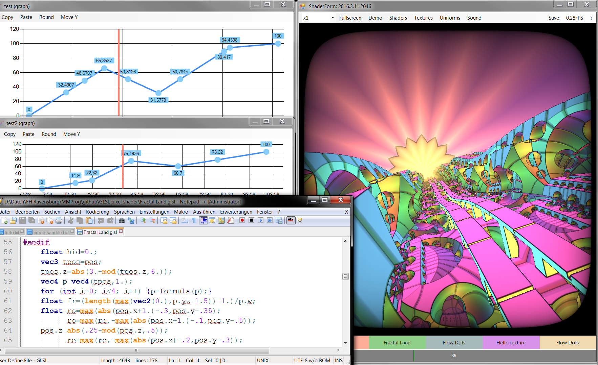

# Shader Form
See the [change log](CHANGELOG.md) for changes, features and road map.

## Look at [Examples](https://github.com/danielscherzer/ACG-shader)

## Create videos
+ Project [DemoRecorder](/src/DemoRecorder): Hier können Bilderfolgen von demos mit fixer frame rate und beliebiger auflösung erzeugt werden. Für die unter euch die richtig smoothe videos haben wollen, nehmen dann diese bilder und z.b. ffmpeg  -framerate 25 -i %1\%%05d.png -c:v libx264 -pix_fmt yuv420p "output.mp4" + euer sound file... und fertig ist das video

## Contribute
Check out the [contribution guidelines](CONTRIBUTING.md)
if you want to contribute to this project.

## License
[Apache 2.0](LICENSE)